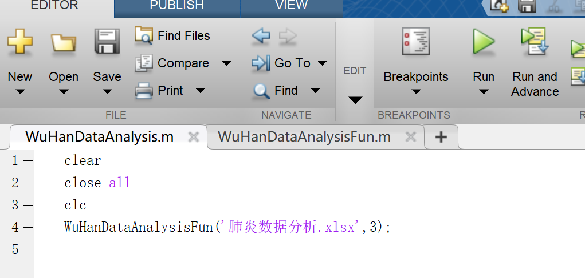
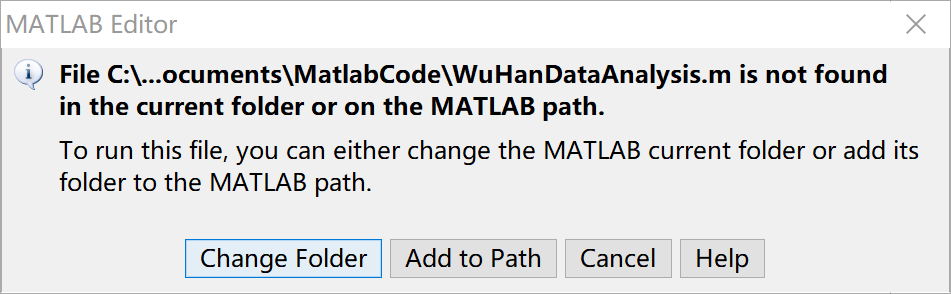
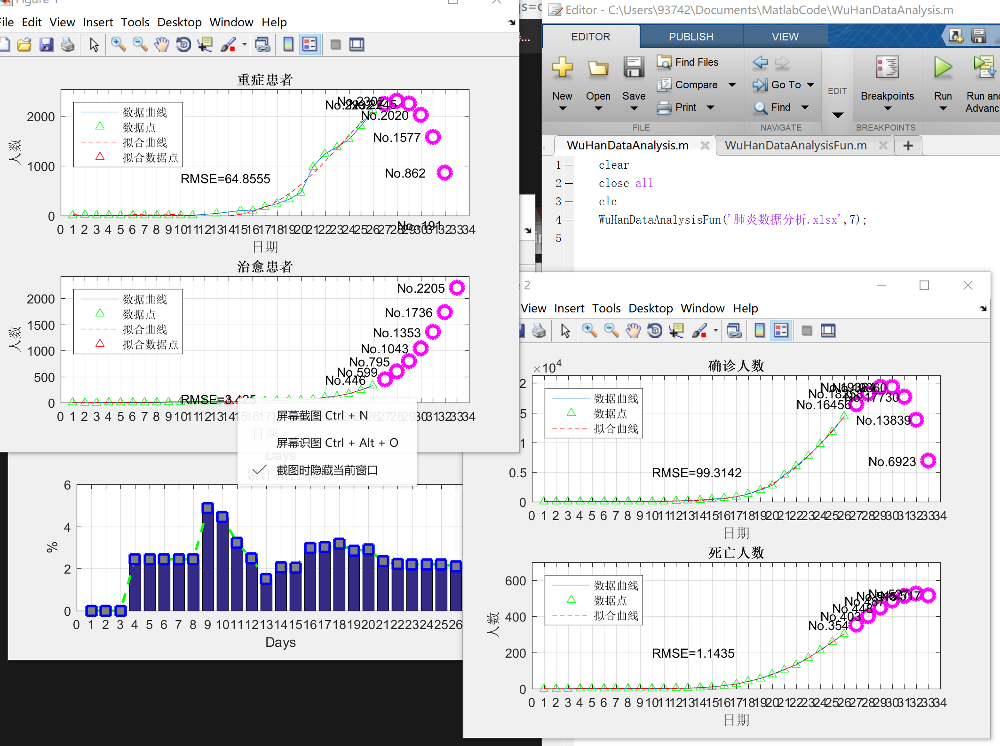

# WuHanDataAnalysis
你可以通过已经公布的数据来看一看未来N天的预期发展情况，纯属娱乐，有限的参考价值 
环境：Win10，Matlab2015b或更高版主 
你可以这样使用：  
  step1:clone文件到本地  
  step2:进入文件夹，用matlab打开文件WuHanDataAnalysis.m  
  step3:运行文件，点击右上角"RUN"  
     
  如果出现类似下面的提示，请选择“Change Folder”  
  
  step4:函数第一个参数为xlsx文件路径，这里是相对路径（也可用绝对路径）保证表格文件与代码文件在同一个文件夹内。第二个参数为预测天数，注意天数越多预测信息鲁棒性越差，修改天数后再次运行，即可得到如下的图像 
  
  step5:如果出现图像文本错乱的现象，打开WuHanDataAnalysisFun.m文件自行修改文本标注位置
