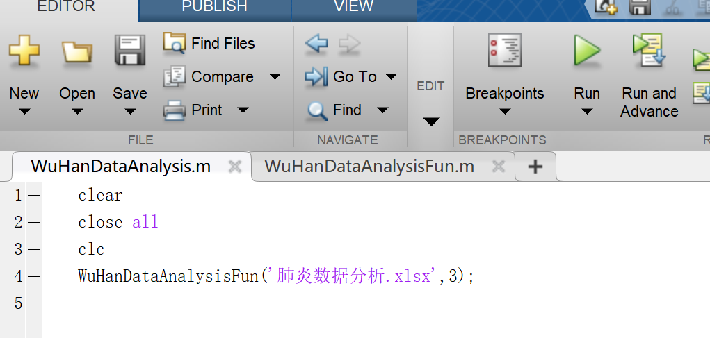

# WuHanDataAnalysis
你可以通过已经公布的数据来看一看未来N天的预期发展情况，纯属娱乐，有限的参考价值 
环境：Win10，Matlab2015b或更高版主 
你可以这样使用：  
  step1:clone文件到本地  
  step2:进入文件夹，用matlab打开文件WuHanDataAnalysis.m  
  step3:运行文件，点击右上角"RUN"  
    
